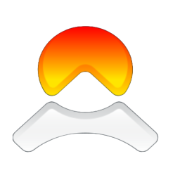

<div align="center">
  
</div>

<h1 align="center">Onerocket-Chatpad</h1>

Fork of [chatpad](https://github.com/deiucanta/chatpad) with newly built features to support the Onerocket.ai API. 

Onerocket is an AI broker/aggregator designed to provide a single path to many LLMs and AI systems. Additionally, it also provides simple one request endpoints to execute more complicated logic. 

Ensure both npm and yarn are installed.

## Yarn build 

```
yarn build
```

## Build docker locally 

```
docker build -t or-chatpad .
```

## Run build locally: 

```
sudo docker run --name chatpad -d -p 8080:80 or-chatpad
```

## Run after build: 

```
docker start chatpad
```

## Re-deploy existing docker container 

If you're updating an existing docker container, use the dockerredpeploy.sh script: 

```
sudo ./dockerredeploy.sh
```